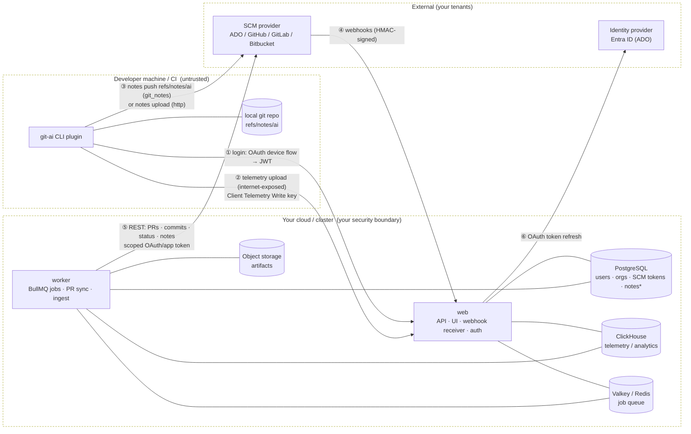
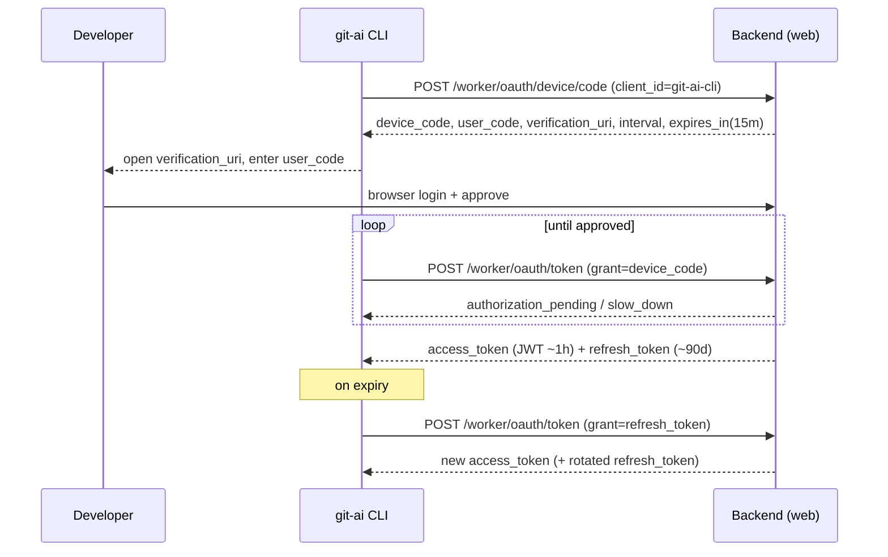
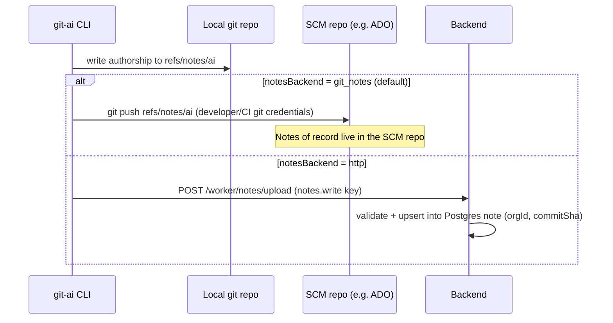
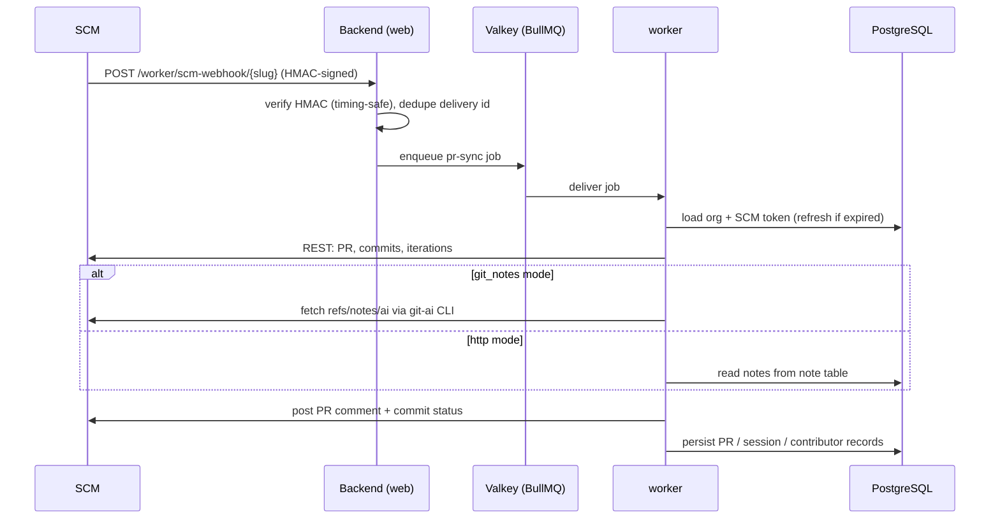

# Git AI — Architecture, Authentication & Data Flow

> **Audience:** Cloud Security and Enterprise Architecture reviewers.
> **Scope:** the **self-hosted** deployment of Git AI — every component runs inside your
> own cloud/cluster. Written **provider-generically** (GitHub, GitLab, Bitbucket, Azure
> DevOps); **Azure DevOps (ADO)** is used as the worked example.

---

## 1. Architecture at a glance

`notes*` lives in PostgreSQL only in `http` notes mode; in the default `git_notes` mode
the notes of record live in your SCM repo. The circled edges ①–⑥ are the trust points
enumerated in [§4](#4-trust-points).

**Deployment:** one container image (`ghcr.io/git-ai-project/git-ai-web-ee`) runs in two
roles — **web** (port 3000) and **worker** (`BULLMQ_WORKER=true`, dashboard 3001) — on
Kubernetes via the Helm chart (AKS/EKS/GKE) or on a single node via Docker Compose.
Datastores are in-cluster (Bitnami PostgreSQL/Valkey, ClickHouse StatefulSet) or external
managed services. Only **web** is exposed via ingress; everything else is internal.

---

## 2. Where the data comes from

Three independent data sources feed the platform. They have different producers, trust
levels, and storage:

| Data class | Produced by | Reaches backend via | Stored in | Notes / sensitivity |
| --- | --- | --- | --- | --- |
| **Client telemetry** | `git-ai` CLI on developer laptops / CI | `POST /worker/metrics/upload` (internet-exposed) | ClickHouse (+ Postgres aggregates) | Usage/session metrics & authorship summaries; written with a least-privilege **Telemetry Write** key |
| **Git notes (authorship)** | `git-ai` CLI, per commit | `git_notes` mode: pushed into SCM as `refs/notes/ai`, backend fetches it. `http` mode: `POST /worker/notes/upload` | `git_notes`: **your SCM repo**. `http`: Postgres `note` table | The authorship record itself (human/AI per line). In default mode it never leaves your SCM |
| **SCM metadata** | SCM provider (ADO/GitHub/…) | Webhooks (`/worker/scm-webhook/{slug}`) + worker REST pulls | Postgres (PRs, commits, contributors), ClickHouse (events) | PR/commit/identity metadata; fetched with scoped OAuth/app tokens |

Derived from these: analytics over sessions, contributors, and PR rollups (ClickHouse +
Postgres). Source code itself is **not** stored — the worker reads repos transiently
during sync and discards the working copy.

---

## 3. Authentication

### 3.1 Client (CLI) → backend

| Mechanism | Purpose | Detail |
| --- | --- | --- |
| **OAuth 2.0 Device Authorization flow** | Interactive CLI login | `POST /worker/oauth/device/code` → user approves in browser → `POST /worker/oauth/token` (`client_id=git-ai-cli`) |
| **JWT access token** | Authenticated API calls | HS256, signed with `WORKER_JWT_SECRET`; ~1h lifetime; `Authorization: Bearer` |
| **Refresh token** | Renew access token | ~90d; rotated on use; `grant_type=refresh_token` |
| **Install nonce** | First-install bootstrap | One-time, ~5m |
| **API keys (scoped)** | Machine-to-machine (CI, telemetry, notes) | `x-api-key`; per-org; least-privilege scopes (below) |

**Token lifecycle / rotation:**

| Token | Lifetime | Storage | Rotation |
| --- | --- | --- | --- |
| Access (JWT) | ~1 h | CLI-side, transient | Re-minted via refresh token |
| Refresh | ~90 d | CLI-side | Rotated on each use |
| Device code | ~15 min | Server-side, one-time | Expires / consumed |
| Install nonce | ~5 min | Server-side, one-time | Expires / consumed |
| API key | Until revoked | Hash stored server-side; created in UI | Manual revoke / recreate |

**API-key scopes** (least privilege; verified in `web/lib/auth/api-key-permissions.ts`):
`telemetry.write`, `notes.read`, `notes.write`, `pr.write`, `admin.read`, `admin.write`.
The CLI/CI uses the narrowest scope for the job — e.g. telemetry upload uses
`telemetry.write` only, which **cannot read** any organization data.

### 3.2 Backend → SCM provider

Per-provider app credentials are supplied via **`SCM_APPS_CONFIG`** (`client_id`,
`client_secret`, `webhook_secret`, `private_key`/PAT, and for ADO a `tenant_id`). Per-org
tokens are stored in the Postgres `account` table and **auto-refreshed** before use.

| Provider | Backend → provider auth | Token refresh endpoint |
| --- | --- | --- |
| **Azure DevOps** | OAuth via **Microsoft Entra ID** (optional PAT fallback) | `https://login.microsoftonline.com/{tenant}/oauth2/v2.0/token` |
| GitHub | GitHub **App installation tokens** (short-lived, re-minted) | n/a (re-issued per request) |
| GitLab | OAuth token / PAT (`PRIVATE-TOKEN`) | `https://{domain}/oauth/token` |
| Bitbucket | OAuth (Basic `client_id:secret`) / app password | `https://bitbucket.org/site/oauth2/access_token` |

### 3.3 Other auth surfaces

- **Web UI:** Better Auth session cookies (sessions in Postgres); tRPC `protectedProcedure`.
- **Internal system-to-system:** `WEB_INTERNAL_API_KEY` (constant-time comparison).
- **Webhooks:** HMAC signature verification (see §4, edge ④).

---

## 4. Trust points

Every cross-boundary connection, what crosses it, and the control that secures it. Edge
numbers match the diagram in §1.

| # | From → To | What crosses | Control / defense |
| --- | --- | --- | --- |
| **①** | Developer CLI → backend (login) | Device-flow login; thereafter JWT | OAuth 2.0 device flow; HS256 JWT signed with `WORKER_JWT_SECRET`; ~1h access / ~90d rotating refresh |
| **②** | Developer laptop → **metrics ingestion endpoint** | Usage/session telemetry | **Internet-exposed by design** (devs/CI push from anywhere). **Defense in depth:** TLS-only, authenticated endpoint requiring an org-scoped **Client Telemetry Write key** (`telemetry.write`) that is **write-only and cannot read any data**, plus a resolved author-identity header. Compromise of the key yields telemetry-write only — no read, no notes, no admin |
| **③** | CLI / CI → SCM repo (notes) | `git_notes`: push `refs/notes/ai`. `http`: `POST /worker/notes/upload` | `git_notes`: the **SCM's own** git auth (developer/CI credentials) — Git AI is not in the path. `http`: org-scoped `notes.write` API key, server-side content validation, upsert keyed `(orgId, commitSha)` |
| **④** | SCM → backend (webhooks) | PR / push events | **HMAC signature verification** (`timingSafeEqual`) against `SCM_WEBHOOK_SECRET_KEY` / per-app `webhook_secret`; delivery-id dedupe. Provider headers: `x-hub-signature-256` (GitHub), `x-gitlab-token`, `x-request-signature` (Bitbucket), `x-azure-devops-secret` (ADO) |
| **⑤** | Worker → SCM (REST) | Fetch PRs/commits/notes, post comments & status | Per-org **OAuth / app token**, **least-privilege scopes** (§5), auto-refreshed; TLS-only egress. ADO uses Entra ID delegated scopes — `vso.code_write` only where notes must be written |
| **⑥** | Backend → Identity provider | OAuth token refresh | OAuth client credentials (`client_id`/`client_secret`) over TLS to the IdP token endpoint; refresh tokens stored encrypted-at-rest in Postgres |
| **⑦** | Browser → web UI | Operator/admin sessions | Better Auth session cookies; org-membership authorization on every route |
| **⑧** | web ↔ worker / internal triggers | System-to-system calls | `WEB_INTERNAL_API_KEY`, constant-time comparison; not internet-exposed |
| **⑨** | Backend → datastores | Postgres / ClickHouse / Valkey / object storage | In-cluster `ClusterIP` (or private managed endpoints); credentialed; TLS where supported; not internet-exposed |

> **Highlight — metrics ingestion (edge ②).** This is the one backend endpoint a developer
> laptop reaches directly over the internet. It is hardened by least privilege rather than
> network reachability alone: the only credential a laptop holds is a **write-only
> telemetry key**. It cannot read org data, cannot touch notes, cannot reach admin APIs,
> and is per-org revocable. This is the defense-in-depth posture for the public surface.

---

## 5. Required SCM scopes (least privilege)

**Azure DevOps** (Entra ID delegated — verified in `web/lib/scm/azure-devops/oauth.ts`):

| Scope | Why |
| --- | --- |
| `vso.code_write` | Read repos; push `refs/notes/ai` (only needed in `git_notes` mode) |
| `vso.code_status` | Post commit status / checks on PRs |
| `vso.identity`, `vso.graph` | Resolve users / org membership for attribution |
| `vso.profile`, `vso.project` | User profile & project metadata |
| `vso.work` | Work-item context (minimal use) |
| `openid`, `profile`, `email`, `offline_access` | OIDC sign-in + refresh tokens |

**GitHub App:** Contents R/W (notes), Commit statuses R/W, Pull requests R/W, webhook
subscriptions. **GitLab:** `api`, `read_user`. **Bitbucket:** `account`, `repository`,
`webhook`.

> In `http` notes mode, write-to-repo capability (e.g. ADO `vso.code_write` for pushing
> notes) is not required; read access still is, for PR sync.

---

## 6. Git notes — two storage modes

Controlled per organization by `organization.notesBackend` (`web/lib/notes/read.ts`):

| | `git_notes` (default) | `http` |
| --- | --- | --- |
| Where notes live | **SCM repo** (`refs/notes/ai`, plus `refs/notes/ai-remote/fork*`) | Backend **Postgres** `note` table, unique `(orgId, commitSha)` |
| Pushed to SCM? | Yes | No |
| Write path | `git push` notes ref (SCM's own auth) | `POST /worker/notes/upload` (`notes.write` key) |
| Read path | `git-ai` fetch from SCM | `GET /worker/notes?commits=…` (`notes.read` key), batched ≤100 |
| Data residency | Authorship of record stays in **your SCM** | Authorship of record stays in **your backend DB** |

---

## 7. Sequence diagrams

### 7.1 CLI login (device flow) + refresh

### 7.2 Authorship → notes write (both modes)

### 7.3 PR sync (webhook-driven)

---

## 8. Security & network requirements

### 8.1 Secret management

Self-hosted secrets are a Kubernetes **Secret** (or `secrets.existingSecret` to plug in
your own vault / external-secrets operator). Core secrets
(`helm/values.yaml`, `helm/templates/secret.yaml`):

| Secret | Purpose |
| --- | --- |
| `betterAuthSecret` | Web session/auth signing |
| `workerJwtSecret` | Sign/verify CLI JWTs |
| `webInternalApiKey` | Internal system-to-system auth |
| `scmWebhookSecretKey` | Verify inbound webhook signatures |
| `SCM_APPS_CONFIG` | Per-provider OAuth/app credentials (incl. ADO `tenant_id`) |
| `DATABASE_URL` / `REDIS_URL` / `CLICKHOUSE_PASSWORD` | Datastore credentials |
| `licenseKey` | Enterprise license |
| Storage / email creds | Object storage + (optional) Resend/SMTP |

Rotation is operator-managed (update the Secret/vault and roll the deployments); no
automatic secret rotation is built in.

### 8.2 Network endpoints

**Inbound:**

| Path | Port | Source | Control |
| --- | --- | --- | --- |
| Web/API + UI | 443 → 3000 | Developers, CI, browsers | TLS at ingress (nginx / Istio) |
| Telemetry ingest (`/worker/metrics/upload`) | 443 → 3000 | Developer laptops / CI | Telemetry Write key (edge ②) |
| SCM webhooks (`/worker/scm-webhook/{slug}`) | 443 → 3000 | SCM provider | HMAC-verified (edge ④) |
| Worker dashboard | 3001 | Internal only | Not publicly exposed |

**Outbound (egress allowlist):**

| Destination | Purpose |
| --- | --- |
| SCM REST APIs — `dev.azure.com`, `api.github.com`, GitLab host, `api.bitbucket.org` | PR sync, comments, status, notes |
| IdP token endpoints — `login.microsoftonline.com` (ADO) / provider OAuth | Token refresh |
| Object storage endpoint (if S3 / Azure Blob / GCS) | Worker artifacts |
| Email provider (optional) — Resend / SMTP relay | Notifications |

All external calls are HTTPS/TLS. No runtime connectivity to any Git AI vendor SaaS is
required; the only external dependency is the container image pull from `ghcr.io`
(mirror-able to a private registry).

### 8.3 Encryption & isolation

- **In transit:** TLS everywhere (ingress, datastore connections, all SCM/IdP egress).
- **At rest:** provided by your datastore / object-storage layer (managed DB encryption,
  bucket SSE, encrypted PVs).
- **Isolation:** datastores are `ClusterIP` / private managed endpoints; only **web** is
  publicly reachable.

---

## 9. Appendix

### Key environment variables / secrets

| Name | Description |
| --- | --- |
| `BETTER_AUTH_SECRET` | Web auth/session signing |
| `WORKER_JWT_SECRET` | Signs/verifies CLI JWTs |
| `WEB_INTERNAL_API_KEY` | Internal system-to-system auth |
| `SCM_WEBHOOK_SECRET_KEY` | Webhook HMAC verification |
| `SCM_APPS_CONFIG` | Per-provider app credentials (incl. ADO `tenant_id`) |
| `DATABASE_URL` / `REDIS_URL` / `CLICKHOUSE_*` | Datastore connections |
| `WEB_BASE_URL` / `BETTER_AUTH_URL` / `WORKER_PUBLIC_BASE_URL` | Public URLs + OAuth callbacks |
| `STORAGE_BACKEND` (+ bucket/connection vars) | `local` / `aws` / `azure` / `gcp` |
| `LICENSE_KEY` | Enterprise license |

> **CLI-side credential storage** (where the `git-ai` CLI persists its tokens on a
> developer machine) is defined in the CLI source repo
> (`github.com/git-ai-project/git-ai`) and should be confirmed there; the backend only
> observes the credential presented on each request.

### Source references

- CLI auth / tokens: `web/lib/worker-oauth/service.ts`, `web/lib/worker-auth.ts`, `web/app/worker/oauth/**`
- Telemetry endpoint & scopes: `web/app/worker/metrics/upload/route.ts`, `web/lib/auth/api-key-permissions.ts`
- Notes storage & API: `web/lib/notes/read.ts`, `web/app/worker/notes/**`
- ADO OAuth & scopes: `web/lib/scm/azure-devops/oauth.ts`
- Webhooks & SCM config: `web/app/worker/scm-webhook/[slug]/route.ts`, `web/lib/scm/config.ts`
- Deployment & secrets: `helm/values.yaml`, `helm/templates/secret.yaml`, `docker-compose/docker-compose.yml`
