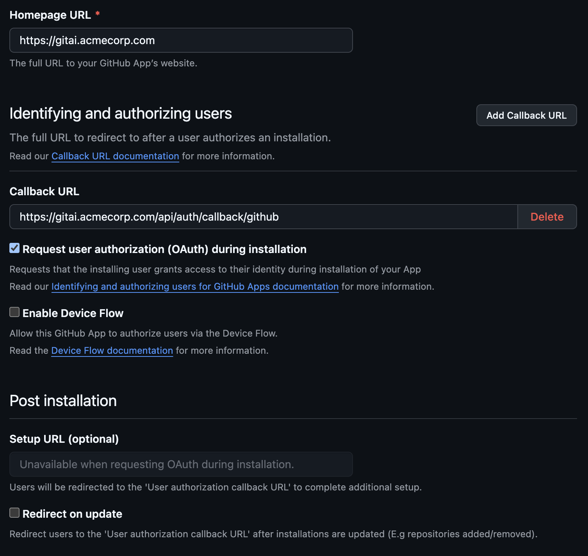
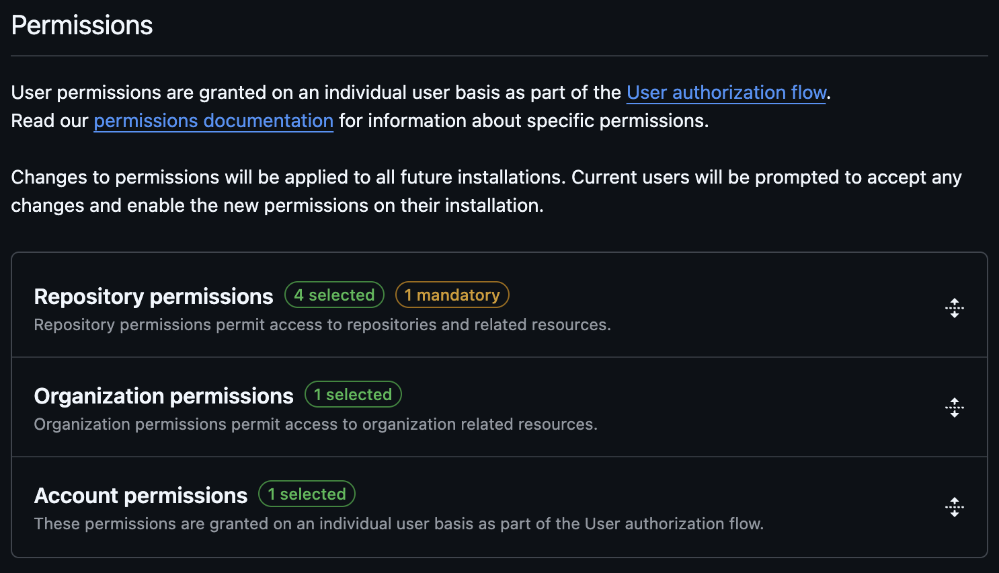
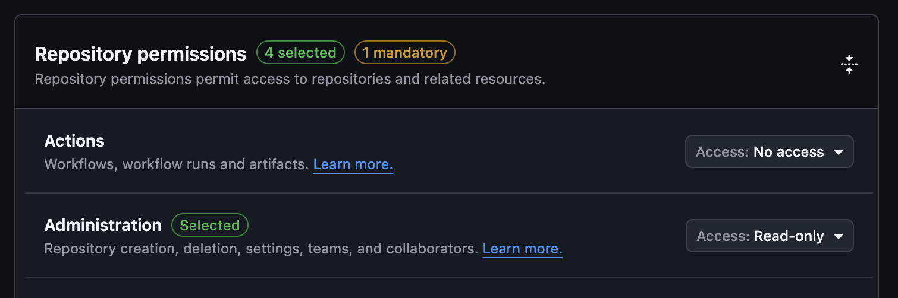
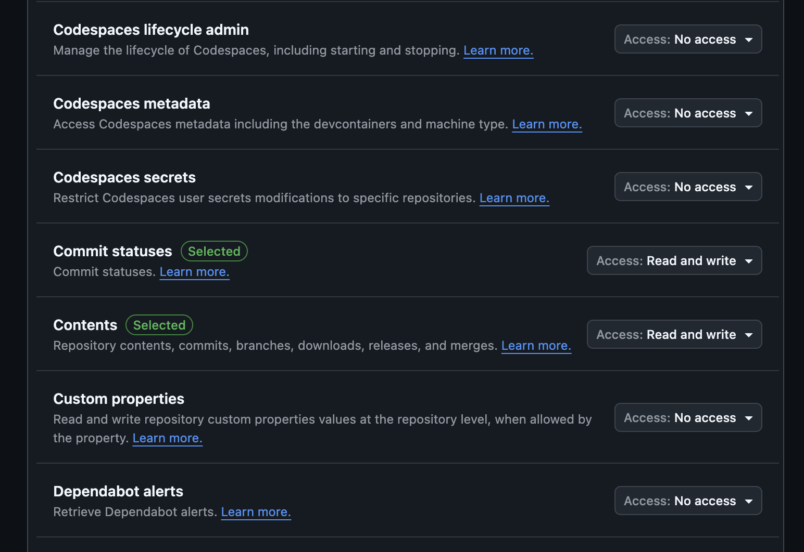
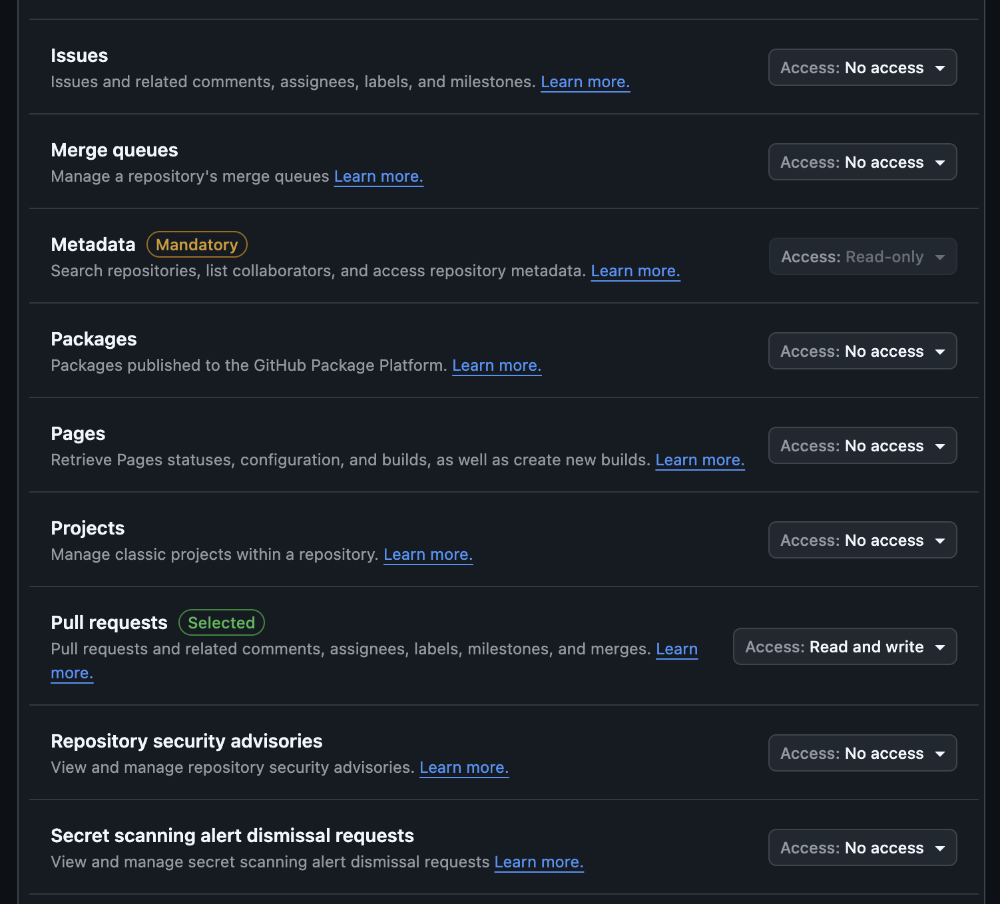
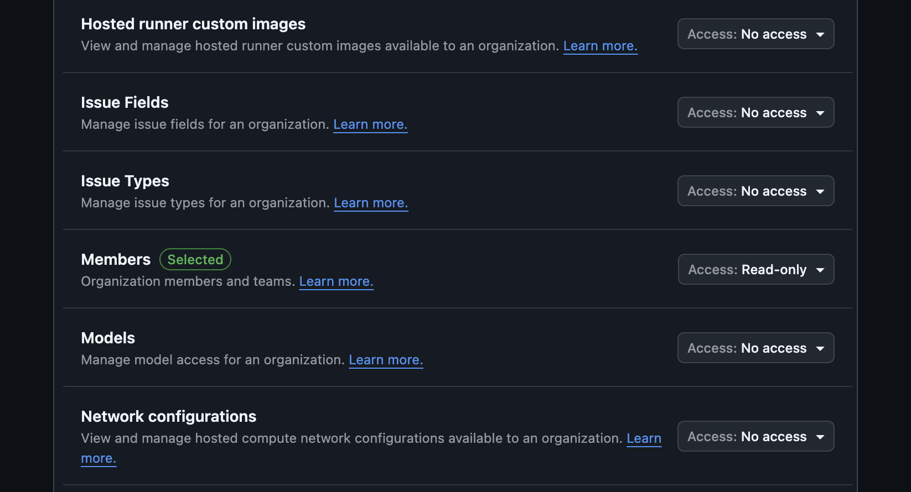
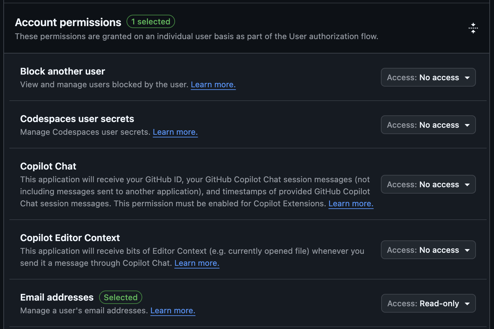
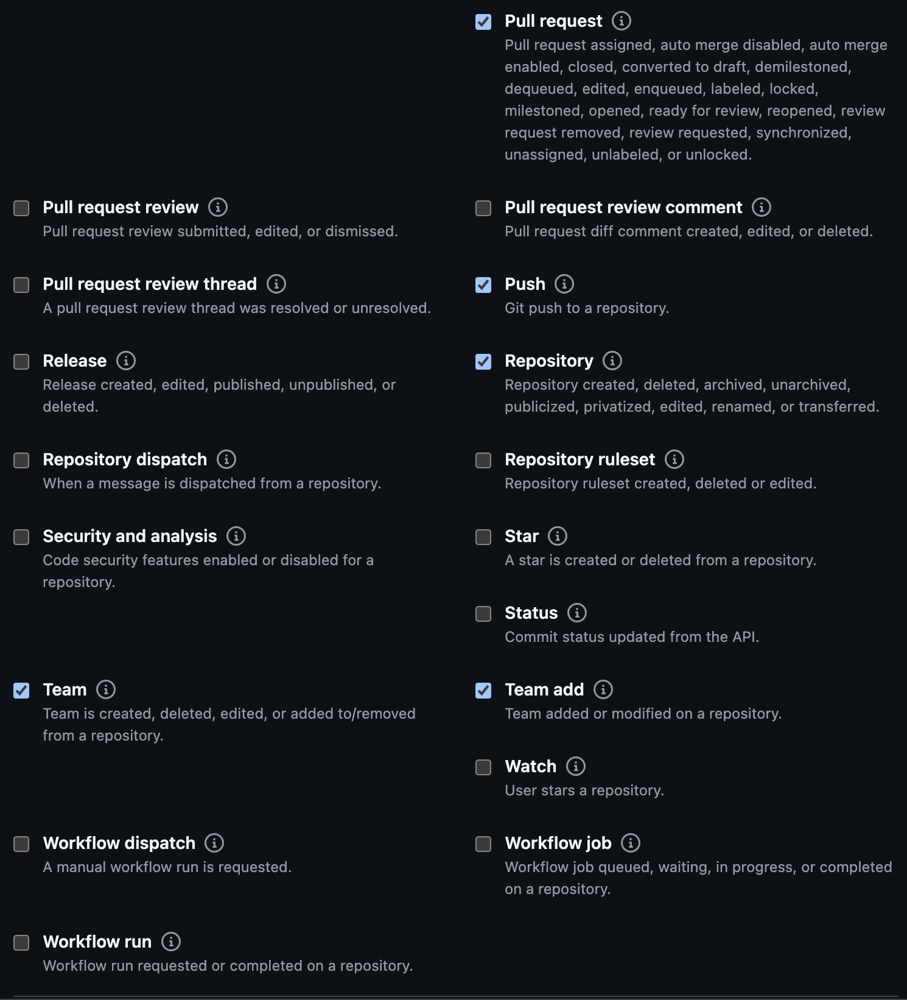
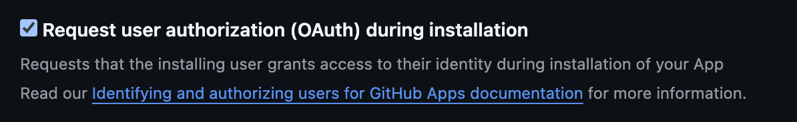

# SCM Setup: GitHub (Optional)

Use this if you want GitHub support. You can skip GitHub and use GitLab/Bitbucket only.

## Required URLs

If `global.webBaseUrl=https://gitai.example.com`:

- Homepage URL: `https://gitai.example.com`
- Callback URL: `https://gitai.example.com/api/auth/callback/github`
- Webhook URL: `https://gitai.example.com/worker/scm-webhook/<github-slug>`

Use the default slug `github` unless you run multiple GitHub instances.
When **Request user authorization (OAuth) during installation** is enabled, leave **Setup URL** empty. GitHub disables it and redirects users back to the **Callback URL** after installation or installation updates.

## Create GitHub App (Step by Step)

1. Open [GitHub App creation](https://github.com/settings/apps/new).
2. Set **GitHub App name** (example: `git-ai-self-hosted`).
3. Set **Homepage URL** to `https://gitai.example.com`.
4. Under **Identifying and authorizing users**, set **Callback URL** to `https://gitai.example.com/api/auth/callback/github`.
5. Enable **Request user authorization (OAuth) during installation**.
6. Leave **Setup URL** empty. GitHub shows it as unavailable when OAuth during installation is enabled and uses the **Callback URL** for the post-install redirect.
7. Leave **Enable Device Flow** disabled unless you explicitly need it.
8. Enable **Active** webhook.
9. Set **Webhook URL** to `https://gitai.example.com/worker/scm-webhook/github` (or your custom slug if you run multiple GitHub instances).
10. Set **Webhook secret** and keep it for the wizard.
11. Create the app.



## GitHub App Permissions

Set the GitHub App permissions to match the PDF/screenshots exactly:

- Repository permissions:
  - Administration: Read-only
  - Commit statuses: Read and write
  - Contents: Read and write
  - Metadata: Read-only (mandatory)
  - Pull requests: Read and write
- Organization permissions:
  - Members: Read-only
- Account permissions:
  - Email addresses: Read-only








## Subscribe to Events

Select these webhook events:

- `Create`
- `Delete`
- `Fork`
- `Installation target`
- `Member`
- `Membership`
- `Meta`
- `Organization`
- `Public`
- `Pull request`
- `Push`
- `Repository`
- `Team`
- `Team add`




## Optional Features

Enable **Request user authorization (OAuth) during installation**.
Do not set **Setup URL** when this option is enabled.



## Generate and Collect Credentials

1. In your app settings, copy **App ID**.
2. In **General**, copy **Client ID** and generate/copy **Client secret**.
3. In **Private keys**, click **Generate a private key** and download the `.pem` file.
4. Keep your webhook secret from creation step.

You will provide all of these to the wizard:

- App ID
- Webhook secret
- OAuth client ID
- OAuth client secret
- Private key PEM file path on disk

Run:

```bash
task scm:configure
```

## Post-Setup Verification

1. Open Git AI sign-in page and confirm **Continue with GitHub** is shown.
2. In Git AI org settings, open SCM settings and install/connect your GitHub app.
3. Confirm webhook deliveries succeed in GitHub app webhook logs.
